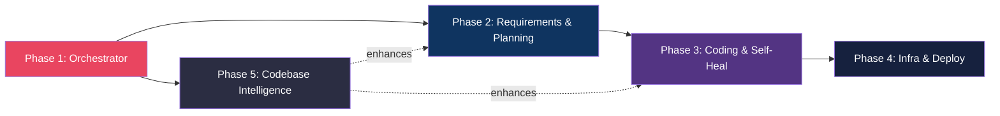

# `/swe` Mode — Autonomous SWE Agent for Pat-Agent

## Background

Pat-Agent is currently a general-purpose AI coding assistant with subagents, tool registry, context management, session persistence, and MCP integration. The goal is to add a new `/swe` mode that transforms the agent into an **autonomous software engineer** capable of: gathering requirements → planning architecture → writing code → self-healing on errors → deploying via GitHub workflows.

## Architecture Overview

```mermaid
graph TD
    U[User: /swe "Build me a SaaS..."] --> OR[SWE Orchestrator]
    OR --> RG[Phase Gate: Requirement Gathering]
    RG --> PS[project_spec.md]
    PS --> PL[Phase Gate: Planning Agent]
    PL --> TQ[Task DAG / Queue]
    TQ --> SA[Specialized Agents]
    SA --> BA[Backend Agent]
    SA --> FA[Frontend Agent]
    SA --> IA[Infra Agent]
    SA --> TA[Testing Agent]
    SA --> DA[DevOps Agent]
    SA --> SEA[Security Agent]
    BA & FA & IA & TA & DA & SEA --> CL[Coding Loop: Write→Run→Verify→Fix→Commit]
    CL --> VE[Verification Engine]
    VE -->|Pass| GIT[Git Commit & Push]
    VE -->|Fail| SH[Self-Healing Loop]
    SH --> CL
    GIT --> DEP[Deployment Provider]
    DEP --> OBS[Observability / Health Check]

    style OR fill:#1a1a2e,stroke:#e94560,color:#fff
    style RG fill:#16213e,stroke:#0f3460,color:#fff
    style PL fill:#16213e,stroke:#0f3460,color:#fff
    style CL fill:#0f3460,stroke:#e94560,color:#fff
    style SH fill:#533483,stroke:#e94560,color:#fff
    style VE fill:#2b2d42,stroke:#8d99ae,color:#fff
```

---

## Critical Design Decisions

> [!IMPORTANT]
> **Decision 1: SWE mode as a parallel orchestrator, NOT a replacement.**
> The `/swe` command launches a `SWEOrchestrator` that internally uses the existing `Agent` class for each sub-phase. The general-purpose agent stays untouched. This means zero regression risk.

> [!IMPORTANT]
> **Decision 2: Phase gates with human approval.**
> Each major transition (spec → plan → code → deploy) pauses for user confirmation. This prevents runaway autonomous behavior while still being hands-off within each phase.

> [!IMPORTANT]
> **Decision 3: Sandboxing via Docker, not direct host execution.**
> All generated code runs inside Docker containers. The agent never executes untrusted code on the host OS.

---

## Open Questions

> [!WARNING]
> 1. **Docker dependency**: Should Docker be a hard requirement, or should we have a fallback "host mode" with safety guardrails for users without Docker?

> [!WARNING]
> 2. **Git authentication**: Should the agent use the user's existing git credentials, or should we add a `/swe configure github-token` flow?

> [!WARNING]
> 3. **Deployment providers**: Which providers should Phase 4 support first? (Vercel, Railway, Docker VPS are the easiest. AWS/GCP are complex.)

> [!WARNING]
> 4. **Cost guardrails**: Should we implement token budget limits per `/swe` session to prevent runaway API costs?

---

# Phase 1 — SWE Orchestrator & Mode Routing

**Goal**: Wire up the `/swe` command, create the orchestrator skeleton, and establish the phase-gate pattern.

**What you'll have at the end**: User types `/swe "Build me X"` → orchestrator launches → prints phase transitions → placeholder phases execute in sequence with approval gates.

### Changes

---

#### [NEW] `Pat-Code/swe/__init__.py`
- Empty init, makes `swe/` a package.

#### [NEW] `Pat-Code/swe/orchestrator.py`
- `SWEOrchestrator` class — the central brain.
- Constructor takes `Config` + user prompt.
- `async run()` method that sequences through phases:
  1. `RequirementPhase` → produces `project_spec.md`
  2. `PlanningPhase` → produces task DAG
  3. `CodingPhase` → executes task DAG
  4. `InfraPhase` → generates infra configs
  5. `DeployPhase` → pushes & deploys
- Each phase returns a `PhaseResult(status, artifacts, next_action)`.
- Between phases: call `await self._approval_gate(phase_name, summary)` which prints a summary and waits for user `y/n`.

#### [NEW] `Pat-Code/swe/phase.py`
- Abstract `Phase` base class:
  ```python
  class Phase(ABC):
      name: str
      async def execute(self, context: SWEContext) -> PhaseResult
  ```
- `PhaseResult` dataclass: `status`, `artifacts: dict`, `errors: list[str]`
- `SWEContext` dataclass: carries state between phases (spec, task_dag, workspace_path, git_info, etc.)

#### [NEW] `Pat-Code/swe/workspace.py`
- `SWEWorkspace` class — manages the project directory.
- `create(path)` → creates the standard project scaffold (`backend/`, `frontend/`, `infra/`, `docs/`, `tests/`, `.github/workflows/`).
- `get_structure()` → returns directory tree as dict.

#### [MODIFY] `Pat-Code/main.py`
- Add `/swe` as a new slash command in `_handle_command()`.
- When triggered: instantiate `SWEOrchestrator` and call `await orchestrator.run()`.
- Wire TUI events so orchestrator phase transitions are visible.

#### [MODIFY] `Pat-Code/config/config.py`
- Add `SWEConfig` model:
  ```python
  class SWEConfig(BaseModel):
      default_stack: str = "fullstack"  # fullstack, backend-only, frontend-only
      sandbox_mode: str = "docker"      # docker, host
      auto_commit: bool = True
      approval_gates: bool = True
  ```
- Add `swe: SWEConfig` field to `Config`.

### Verification
- Run `/swe "Build a todo app"` → see phase names printed → approval gates pause → all phases complete (with placeholder output).
- Unit test: `SWEOrchestrator` sequences phases correctly and stops on rejection.

---

# Phase 2 — Requirement Gathering & Planning Agents

**Goal**: Build the two "thinking" phases that produce `project_spec.md` and a task DAG before any code is written.

**What you'll have at the end**: Agent asks clarifying questions, generates a structured spec, then produces an architecture plan with a dependency-ordered task list.

### Changes

---

#### [NEW] `Pat-Code/swe/phases/requirement_phase.py`
- `RequirementPhase(Phase)` implementation.
- Uses a dedicated LLM call with a **requirement-gathering system prompt** that instructs the model to:
  - Ask 5-8 clarifying questions (stack, DB, auth, deployment, scale).
  - Infer answers from context if user is brief.
  - Output a structured `project_spec.md`.
- Interactive Q&A loop: agent asks → user answers → agent refines → repeat until spec is complete.
- Spec format:
  ```markdown
  # Project Specification
  ## Overview
  ## Stack Decisions
  ## Features (MVP)
  ## Database Schema (high-level)
  ## Auth Strategy
  ## Deployment Target
  ## Non-Functional Requirements
  ```
- Saves spec to `SWEContext.workspace / "docs" / "project_spec.md"`.

#### [NEW] `Pat-Code/swe/phases/planning_phase.py`
- `PlanningPhase(Phase)` implementation.
- Reads `project_spec.md` from context.
- Uses LLM to generate:
  - `ARCHITECTURE.md` — system design with component diagram.
  - `task_dag.json` — ordered list of tasks with dependencies:
    ```json
    {
      "tasks": [
        {"id": "t1", "name": "setup_nextjs", "depends_on": [], "agent": "frontend"},
        {"id": "t2", "name": "setup_fastapi", "depends_on": [], "agent": "backend"},
        {"id": "t3", "name": "create_auth", "depends_on": ["t1", "t2"], "agent": "backend"},
        {"id": "t4", "name": "setup_postgres", "depends_on": ["t2"], "agent": "infra"}
      ]
    }
    ```
- Validates DAG for cycles using topological sort.
- Saves artifacts to workspace.

#### [NEW] `Pat-Code/swe/task_dag.py`
- `TaskDAG` class: load/save JSON, topological sort, get next executable tasks, mark complete.
- `Task` dataclass: `id, name, description, depends_on, agent_type, status`.
- `get_ready_tasks()` → returns tasks whose dependencies are all complete (enables parallelism later).

#### [NEW] `Pat-Code/swe/prompts/`
- `requirement_prompt.py` — system prompt for requirement gathering.
- `planning_prompt.py` — system prompt for architecture & task DAG generation.

#### [MODIFY] `Pat-Code/swe/orchestrator.py`
- Replace placeholder Phase 1 & 2 with real `RequirementPhase` and `PlanningPhase`.
- After requirement phase: print spec summary, ask for approval.
- After planning phase: print task DAG summary, ask for approval.

### Verification
- `/swe "Build a SaaS for AI interview prep"` → agent asks questions → generates spec → generates architecture + task DAG.
- Validate: `task_dag.json` passes topological sort without cycles.
- Validate: spec contains all required sections.

---

# Phase 3 — Coding Loop, Verification & Self-Healing

**Goal**: Build the core coding engine that executes tasks from the DAG, verifies each one, and self-heals on failure. This is the heart of the SWE agent.

**What you'll have at the end**: Agent picks tasks from the DAG, writes code, runs build/tests, auto-fixes errors, commits on success.

### Changes

---

#### [NEW] `Pat-Code/swe/phases/coding_phase.py`
- `CodingPhase(Phase)` — iterates through `TaskDAG`:
  ```
  for task in dag.topological_order():
      result = await self._execute_task(task)
      if result.success:
          dag.mark_complete(task.id)
          await self._git_commit(task)
      else:
          await self._self_heal(task, result.errors)
  ```
- Each task is delegated to a **specialized SWE subagent** based on `task.agent_type`.

#### [NEW] `Pat-Code/swe/agents/`
- `base_swe_agent.py` — `SWESubagent` base class. Extends the existing `SubagentDefinition` pattern but with:
  - Write access (not read-only like current subagents).
  - A coding-specific system prompt.
  - Access to `shell`, `write_file`, `edit`, `read_file`, `grep`.
- `backend_agent.py` — Backend specialist (FastAPI, Express, Django patterns).
- `frontend_agent.py` — Frontend specialist (Next.js, Vite, React patterns).
- `testing_agent.py` — Writes and runs tests.
- Each agent gets the `project_spec.md` + relevant portion of `ARCHITECTURE.md` as context.

#### [NEW] `Pat-Code/swe/verification.py`
- `VerificationEngine` class with methods:
  - `verify_syntax(lang, path)` → runs language-specific linter/compiler.
  - `verify_tests(path)` → detects test framework and runs tests.
  - `verify_build(path)` → runs build command.
- Language detection from file extensions.
- Returns `VerificationResult(passed, errors, stdout, stderr)`.

#### [NEW] `Pat-Code/swe/self_heal.py`
- `SelfHealingLoop` class:
  ```
  for attempt in range(max_retries):  # default 5
      errors = verification_result.errors
      analysis = await llm.analyze_errors(errors)  # classify, localize
      patch = await coding_agent.fix(analysis)
      result = await verification.run()
      if result.passed:
          return Success
  return Failure(escalate_to_user=True)
  ```
- Error classifier: syntax error, import error, type error, runtime error, test failure.
- Stack trace parser: extracts file, line, error message.
- Escalation: after N failures, asks the user for help.

#### [NEW] `Pat-Code/swe/git_manager.py`
- `GitManager` class:
  - `init_repo(path)` — `git init`.
  - `commit(message)` — `git add . && git commit -m "..."`.
  - `create_branch(name)`.
  - `push(remote, branch)`.
  - Uses conventional commit format: `feat(auth): implement JWT middleware`.
- Wraps `shell` tool calls.

#### [MODIFY] `Pat-Code/swe/orchestrator.py`
- Wire `CodingPhase` with real `TaskDAG` iteration.
- After each task: show progress (e.g., `[3/12] ✓ setup_postgres`).
- On phase complete: show summary of all tasks.

### Verification
- End-to-end: `/swe "Build a REST API with Express and PostgreSQL"` → generates spec → plans tasks → writes code → runs `npm run build` → fixes errors → commits.
- Unit test: `SelfHealingLoop` retries correctly and escalates after max retries.
- Unit test: `GitManager` produces correct conventional commit messages.

---

# Phase 4 — Infrastructure, CI/CD & Deployment

**Goal**: Generate Docker configs, GitHub Actions workflows, and deploy to a provider. Add human approval gates for cost-sensitive operations.

**What you'll have at the end**: Agent generates production-ready infra configs and can push + deploy autonomously (with approval).

### Changes

---

#### [NEW] `Pat-Code/swe/phases/infra_phase.py`
- `InfraPhase(Phase)` — reads spec and generates:
  - `Dockerfile` (multi-stage, optimized).
  - `docker-compose.yml` (app + DB + redis if needed).
  - `.env.example` with all required vars.
  - `nginx.conf` if reverse proxy is needed.
- Uses LLM with infra-specific prompt + spec as context.

#### [NEW] `Pat-Code/swe/phases/deploy_phase.py`
- `DeployPhase(Phase)`:
  1. Generate `.github/workflows/ci.yml` (lint → test → build → deploy).
  2. Create GitHub repo (via `gh` CLI or GitHub API).
  3. Push code.
  4. Trigger deployment.
- **Approval gate before any deployment action** — shows estimated cost, provider, and what will happen.

#### [NEW] `Pat-Code/swe/deploy/`
- `provider.py` — Abstract `DeploymentProvider`:
  ```python
  class DeploymentProvider(ABC):
      async def deploy(self, workspace) -> DeployResult
      async def rollback(self) -> bool
      async def get_logs(self) -> str
      async def health_check(self) -> bool
  ```
- `docker_vps.py` — Deploy via SSH + docker-compose (simplest first).
- `github_pages.py` — For static sites.
- Provider selection based on `project_spec.md` deployment target.

#### [NEW] `Pat-Code/swe/templates/`
- Jinja2 or string templates for:
  - `Dockerfile` (Python, Node.js, Go variants).
  - `docker-compose.yml`.
  - `ci.yml` (GitHub Actions).
  - `nginx.conf`.
- Templates are parameterized by spec values (port, DB type, etc.).

#### [MODIFY] `Pat-Code/swe/orchestrator.py`
- Wire `InfraPhase` and `DeployPhase`.
- Add cost estimation display before deploy approval gate.

#### [MODIFY] `Pat-Code/config/config.py`
- Add deployment config fields to `SWEConfig`:
  ```python
  github_token: str | None = None
  deploy_provider: str = "docker-vps"  # docker-vps, github-pages, vercel, railway
  deploy_host: str | None = None       # SSH host for VPS deploys
  ```

### Verification
- Generate infra for a Node.js + PostgreSQL app → validate Dockerfile builds → validate docker-compose starts.
- Generate CI workflow → validate YAML syntax.
- Mock deployment test: push to a test GitHub repo.

---

# Phase 5 — Codebase Intelligence (AST, Graphs, RAG)

**Goal**: Build the smart context retrieval layer so the SWE agent can work on **existing large codebases**, not just greenfield projects. This is the "brain upgrade" that makes everything from Phases 1-4 dramatically better.

**What you'll have at the end**: Agent can index any repo, build dependency graphs, retrieve relevant code via hybrid search, and make surgical edits with full architectural awareness.

### Changes

---

#### [NEW] `Pat-Code/swe/indexer/`
- `repo_indexer.py` — Scans a repository and builds:
  - File manifest (path, language, size, last modified).
  - Symbol table (functions, classes, exports per file).
  - Uses `tree-sitter` for AST parsing (Python, JS/TS, Go, Rust, Java).
  - Outputs `repo_index.json`.
- `ast_navigator.py` — Wraps tree-sitter for:
  - `get_functions(file)`, `get_classes(file)`, `get_imports(file)`.
  - `find_definition(symbol)`, `find_references(symbol)`.
  - Scope-aware navigation.

#### [NEW] `Pat-Code/swe/indexer/graph.py`
- `DependencyGraph` class (uses `networkx` or custom adjacency list):
  - **Import graph**: file → imported files.
  - **Call graph**: function → called functions.
  - **Symbol graph**: class/function definitions and references.
  - `get_impact_radius(file)` → all files affected by a change.
  - `trace_path(symbol_a, symbol_b)` → shortest dependency path.

#### [NEW] `Pat-Code/swe/indexer/summarizer.py`
- `HierarchicalSummarizer`:
  - Function-level summaries (1 line each).
  - File-level summaries (2-3 lines each).
  - Module-level summaries (paragraph).
  - Repo-level summary (1 paragraph).
- Uses LLM for summarization, caches results.
- Progressive zoom: agent starts with repo summary, drills into module, then file, then function.

#### [MODIFY] `Pat-Code/vector_store/memory_manager.py`
- Extend `FaissMemoryStore` to support **code-aware chunking**:
  - Chunk by function/class boundaries (from AST), not arbitrary token counts.
  - Store metadata: file path, symbol name, language, summary.
- Add hybrid retrieval: semantic search + keyword (BM25) + graph traversal.

#### [NEW] `Pat-Code/swe/retrieval.py`
- `HybridRetriever` class combining:
  1. **Semantic**: vector similarity from FAISS.
  2. **Structural**: graph traversal from `DependencyGraph`.
  3. **Keyword**: grep/ripgrep for exact matches.
  4. **AST**: tree-sitter for structural queries.
- Fusion scoring: weighted combination of all four signals.
- `retrieve(query, top_k)` → returns ranked list of code chunks with context.

#### [MODIFY] `Pat-Code/swe/phases/coding_phase.py`
- Before writing code for a task, use `HybridRetriever` to pull relevant existing code.
- Before editing existing files, use `DependencyGraph.get_impact_radius()` to understand blast radius.
- Feed retrieved context into the coding agent's prompt.

#### [NEW] New dependency in `pyproject.toml`
- `tree-sitter>=0.21.0` and language grammars (`tree-sitter-python`, `tree-sitter-javascript`, etc.).
- `networkx>=3.0` for graph operations.

### Verification
- Index a medium repo (e.g., your own Pat-Code) → validate symbol table completeness.
- Query "auth middleware" → verify hybrid retrieval returns relevant files.
- Test impact radius: modify `agent.py` → verify graph shows `session.py`, `main.py` as affected.

---

## Dependency Map Between Phases



> [!NOTE]
> Phase 5 can be started in parallel with Phase 3/4 since it's an enhancement layer. However, it will provide the most value once integrated into Phase 3's coding loop.

---

## Summary of New Files

| Phase | New Files | Modified Files |
|-------|-----------|----------------|
| **1** | `swe/__init__.py`, `swe/orchestrator.py`, `swe/phase.py`, `swe/workspace.py` | `main.py`, `config/config.py` |
| **2** | `swe/phases/requirement_phase.py`, `swe/phases/planning_phase.py`, `swe/task_dag.py`, `swe/prompts/requirement_prompt.py`, `swe/prompts/planning_prompt.py` | `swe/orchestrator.py` |
| **3** | `swe/phases/coding_phase.py`, `swe/agents/base_swe_agent.py`, `swe/agents/backend_agent.py`, `swe/agents/frontend_agent.py`, `swe/agents/testing_agent.py`, `swe/verification.py`, `swe/self_heal.py`, `swe/git_manager.py` | `swe/orchestrator.py` |
| **4** | `swe/phases/infra_phase.py`, `swe/phases/deploy_phase.py`, `swe/deploy/provider.py`, `swe/deploy/docker_vps.py`, `swe/deploy/github_pages.py`, `swe/templates/*` | `swe/orchestrator.py`, `config/config.py` |
| **5** | `swe/indexer/repo_indexer.py`, `swe/indexer/ast_navigator.py`, `swe/indexer/graph.py`, `swe/indexer/summarizer.py`, `swe/retrieval.py` | `vector_store/memory_manager.py`, `swe/phases/coding_phase.py`, `pyproject.toml` |

---

## Verification Plan

### Per-Phase Testing
- **Phase 1**: Unit test orchestrator sequencing + approval gates. Manual test `/swe` command routing.
- **Phase 2**: Unit test DAG topological sort + cycle detection. Manual test Q&A flow.
- **Phase 3**: Unit test self-healing retry logic. Integration test: generate + build a simple Express app.
- **Phase 4**: Validate generated Dockerfile/CI YAML syntax. Mock deployment test.
- **Phase 5**: Index Pat-Code itself. Benchmark retrieval accuracy. Test impact radius correctness.

### End-to-End Smoke Test (After Phase 4)
```
/swe "Build a REST API with Node.js, Express, PostgreSQL, JWT auth, and deploy to Docker VPS"
```
Expected: Full autonomous flow from questions → spec → plan → code → tests → infra → deploy.
